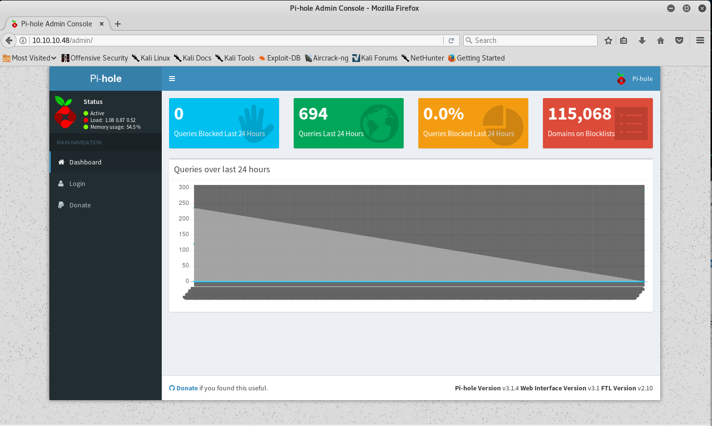
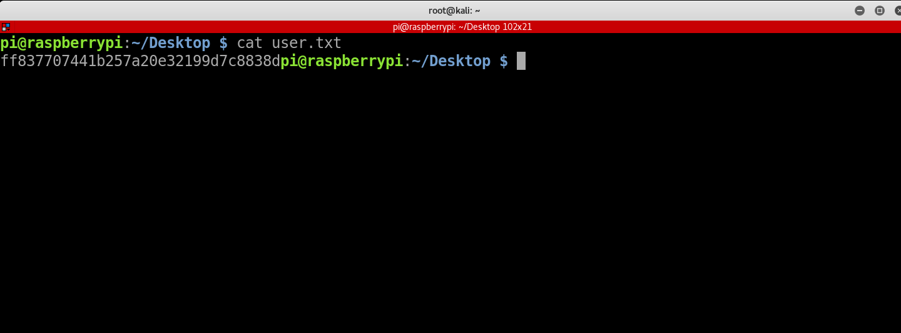

Mirai
==========


Solution
==========

User
-----

This machine is one of the easiest machines and the first machine I did on hack the box.

First step, just like every machine, we do a nmap scan.

`nmap -sV -sC -o 10.10.10.48 `

The result is as follows

```
Starting Nmap 7.60 ( https://nmap.org ) at 2018-02-08 02:23 EST
Nmap scan report for 10.10.10.48
Host is up (0.28s latency).
Not shown: 996 closed ports
PORT     STATE SERVICE VERSION
22/tcp   open  ssh     OpenSSH 6.7p1 Debian 5+deb8u3 (protocol 2.0)
| ssh-hostkey: 
|   1024 aa:ef:5c:e0:8e:86:97:82:47:ff:4a:e5:40:18:90:c5 (DSA)
|   2048 e8:c1:9d:c5:43:ab:fe:61:23:3b:d7:e4:af:9b:74:18 (RSA)
|   256 b6:a0:78:38:d0:c8:10:94:8b:44:b2:ea:a0:17:42:2b (ECDSA)
|_  256 4d:68:40:f7:20:c4:e5:52:80:7a:44:38:b8:a2:a7:52 (EdDSA)
53/tcp   open  domain  dnsmasq 2.76
| dns-nsid: 
|_  bind.version: dnsmasq-2.76
80/tcp   open  http    lighttpd 1.4.35
|_http-server-header: lighttpd/1.4.35
|_http-title: Site doesn't have a title (text/html; charset=UTF-8).
1061/tcp open  upnp    Platinum UPnP 1.0.5.13 (UPnP/1.0 DLNADOC/1.50)
```

We can see the common port 22 and port 80 are open.
Navigating to the webpage we were presented with a blank page.
Therefore, I did a basic web app enumeration on port 80

`gobuster -w /usr/share/wordlists/dirbuster/directory-list-2.3-medium.txt -u 10.10.10.48 -t 25 `

we were then presented with a admin sub directory



It's a Pi-hole application. As I just started out, I didn't know about the application before. However after a google search, 
I found out it's a DNS-sinkhole application, which acts as a DNS server that supplies false DNS information.

Now, I spent a bit time searching for known vulnerability for the application, but it later turned out that it was the wrong way.
I also tried to ssh with all the credentials that Mirai botnet used but to no avail. It seems that I was missing something
 obvious.
 
 Finally, taking account into the 'Pi'-hole application, and the targeted devices in the Mirai Botnet attack, I did an ssh 
 with the default credential of Raspberry-Pi, and got user.
 
 
 
 root
 ------
 My first step for priv esc was `sudo -l`
 
 ```
 pi@raspberrypi:~/Desktop $ sudo -l
Matching Defaults entries for pi on localhost:
    env_reset, mail_badpass,
    secure_path=/usr/local/sbin\:/usr/local/bin\:/usr/sbin\:/usr/bin\:/sbin\:/bin

User pi may run the following commands on localhost:
    (ALL : ALL) ALL
    (ALL) NOPASSWD: ALL

```
It turns out we can run sudo without password!

So I became root with `sudo su` and tried to cat the root.txt file


```
root@raspberrypi:~# cat root.txt
I lost my original root.txt! I think I may have a backup on my USB stick...
root@raspberrypi:~#
```

Not that easy huh, now we have to find the backup on a usb. Googling how to view and mount usbs.

```
root@raspberrypi:/# lsblk
NAME   MAJ:MIN RM  SIZE RO TYPE MOUNTPOINT
sda      8:0    0   10G  0 disk 
├─sda1   8:1    0  1.3G  0 part /lib/live/mount/persistence/sda1
└─sda2   8:2    0  8.7G  0 part /lib/live/mount/persistence/sda2
sdb      8:16   0   10M  0 disk /media/usbstick
sr0     11:0    1 1024M  0 rom  
loop0    7:0    0  1.2G  1 loop /lib/live/mount/rootfs/filesystem.squashfs
root@raspberrypi:/#
```

It seems that the usb is already mounted, not sure if it was other user cuz I didn't do a reset. Anyways you can mount
a usb with the simple command `sudo mount /dev/sdb /media/usbstick`

```
root@raspberrypi:/media/usbstick# ls -la
total 18
drwxr-xr-x 3 root root  1024 Aug 14 05:27 .
drwxr-xr-x 3 root root  4096 Aug 14 05:11 ..
-rw-r--r-- 1 root root   129 Aug 14 05:19 damnit.txt
drwx------ 2 root root 12288 Aug 14 05:15 lost+found
root@raspberrypi:/media/usbstick# cat damnit.txt 
Damnit! Sorry man I accidentally deleted your files off the USB stick.
Do you know if there is any way to get them back?

-James
root@raspberrypi:/media/usbstick#
```

Another hint leading to lost+found, but the directory lost+found is empty.
However in linux everything is a file. Doing a simple strings command on /dev/sdb:

```
root@raspberrypi:/media/usbstick# strings /dev/sdb
>r &
/media/usbstick
lost+found
root.txt
damnit.txt
>r &
>r &
/media/usbstick
lost+found
root.txt
damnit.txt
>r &
/media/usbstick
2]8^
lost+found
root.txt
damnit.txt
>r &
3d3e483143ff12ec505d026fa13e020b
Damnit! Sorry man I accidentally deleted your files off the USB stick.
Do you know if there is any way to get them back?
-James
root@raspberrypi:/media/usbstick# 
```

There goes our root.txt!
