Node
================


Solution
==============

User
---------
First step is a normal nmap scan, and we got the following results
```
# Nmap 7.60 scan initiated Sat Feb  3 18:55:44 2018 as: nmap -sV -oN nmapoutput 10.10.10.58
Nmap scan report for 10.10.10.58
Host is up (0.29s latency).
Not shown: 998 filtered ports
PORT     STATE SERVICE VERSION
22/tcp   open  ssh     OpenSSH 7.2p2 Ubuntu 4ubuntu2.2 (Ubuntu Linux; protocol 2.0)
3000/tcp open  http    Node.js Express framework
Service Info: OS: Linux; CPE: cpe:/o:linux:linux_kernel

Service detection performed. Please report any incorrect results at https://nmap.org/submit/ .
# Nmap done at Sat Feb  3 18:56:21 2018 -- 1 IP address (1 host up) scanned in 36.78 seconds
```
Navigating to the service on port 3000, we get a webpage and a login prompt at the upper right corner.


Tried some basic SQL injections but didn't work. However browsing at some tabs in inspectors revealed some
interesting files.

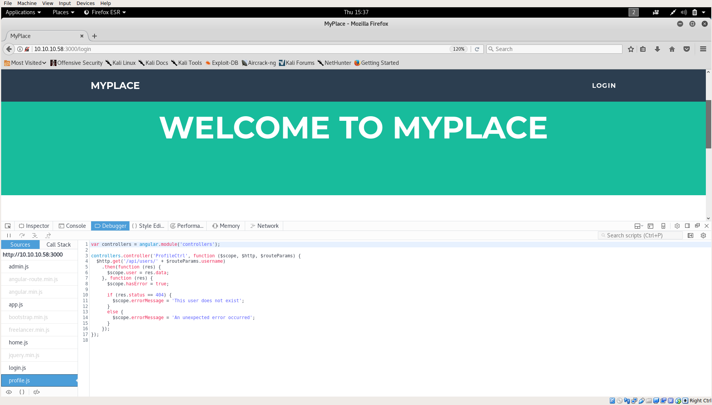

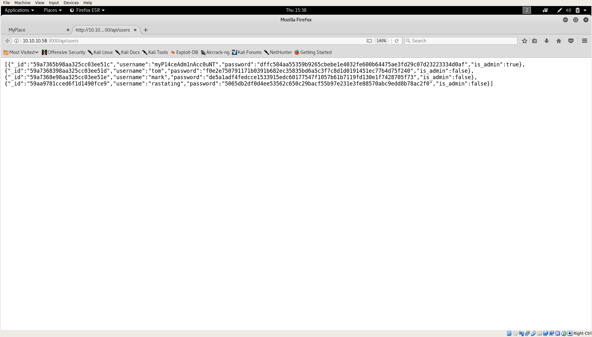

Now we get some usernames and hashes. First I used hash-identifier to identify the hash and then used hashcat with the 
handy rockyou wordlist to crack it.

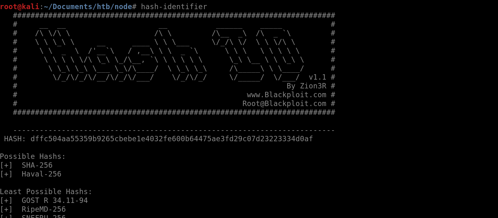

I turned out to be a simple SHA-256 hash, which we were able to crack with hashcat under a minute.

```
root@kali:~/Documents/htb/node# cat cracked.txt
dffc504aa55359b9265cbebe1e4032fe600b64475ae3fd29c07d23223334d0af:manchester
```
Nice! We got the password and logged in to the admin account.

Next we were presented with a backup to download, however the major problem is that the backup file keeps terminating around 
6 seconds. 

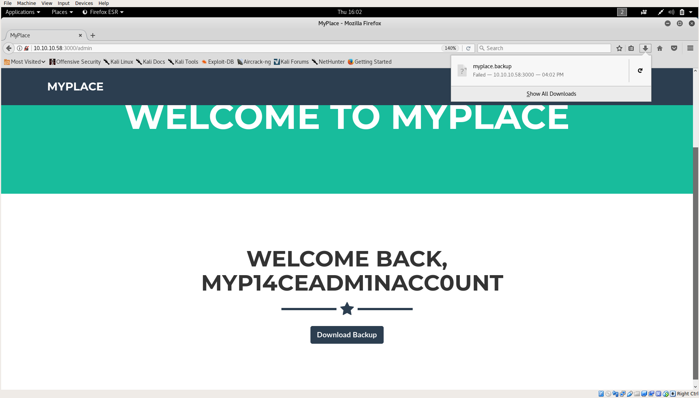

This got me stuck for a while, judging from the web response I could get some base64 encoded characters, which 
were decoded to a password-protected corrupted zip file.

First I recovered the zip file after googling about it
```
root@kali:~/Documents/htb/node/copy_from_response# zip -FF myplace.zip --out recovered.zip
Fix archive (-FF) - salvage what can
	zip warning: Missing end (EOCDR) signature - either this archive
                     is not readable or the end is damaged
Is this a single-disk archive?  (y/n): y
  Assuming single-disk archive
Scanning for entries...
 copying: var/www/myplace/  (0 bytes)
```
 
Next I used fcrackzip to crack the password for the zip file and unzipped it.
```
 root@kali:~/Documents/htb/node/copy_from_response# fcrackzip -D -p /usr/share/wordlists/rockyou.txt recovered.zip 
possible pw found: magicword ()
```
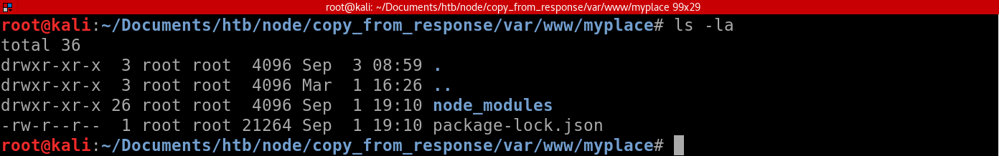

Okay, so I spent a bunch of time going through all the node modules and stuffs but didn't find anything interesting, 
I guess downloading just stopped before the interesting file was downloaded.

Note: I didn't figure out why this happens, but I managed to solve it by downloading multiple times, and when it reached 
64% I could see the interesting file - app.js

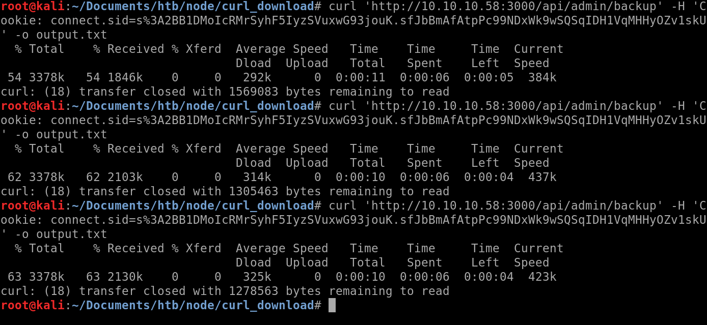

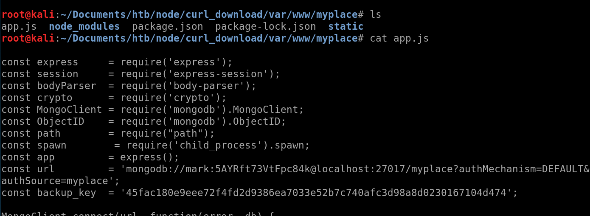

We can see the credentials as clear text `mark:5AYRft73VtFpc84k`

SSH with that credential and we're finally in!

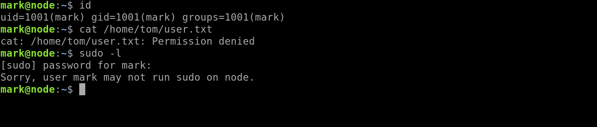

However, as we can see, we are unable to cat the user file as it belongs to the user 'tom'
(getting user is taking so long...)

Like always, I do `sudo -l` and `ps aux` first to find any exploitable targets.

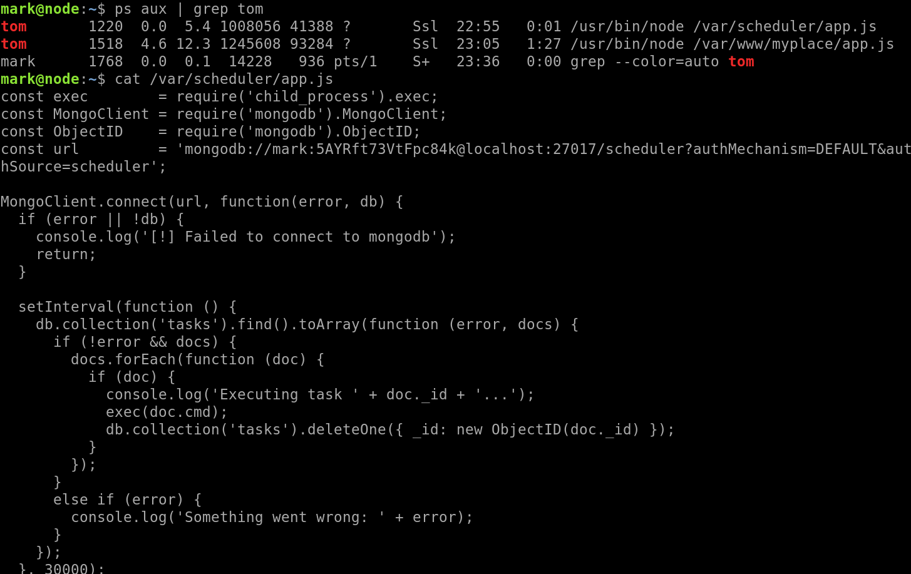

As our target is Tom now, I saw what services Tom was running, and as we can see, a scheduler is running!

Basically that scheduler is executing every cmds in the `tasks` collection in mongodb. Another great thing is that Tom logged 
in to mongodb with Mark's username, so we could insert tasks on our own and Tom would run it.

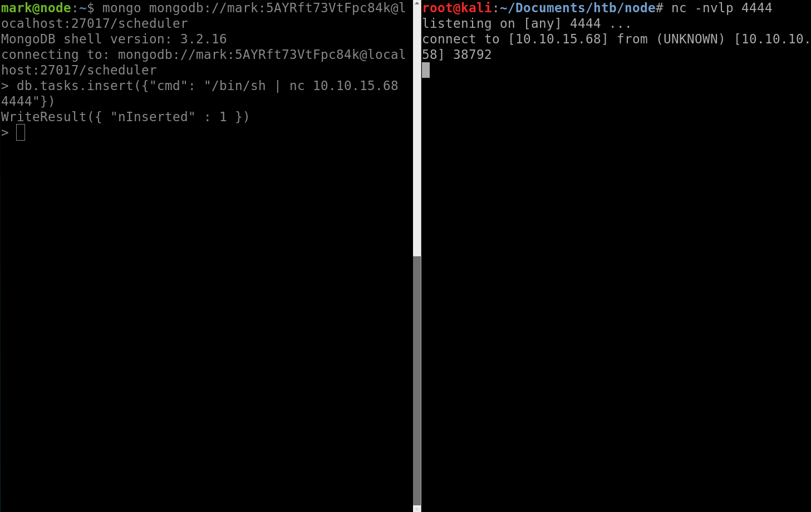

Great! We've got command execution! Now grab one of the reverse shell scripts from https://highon.coffee/blog/reverse-shell-cheat-sheet/

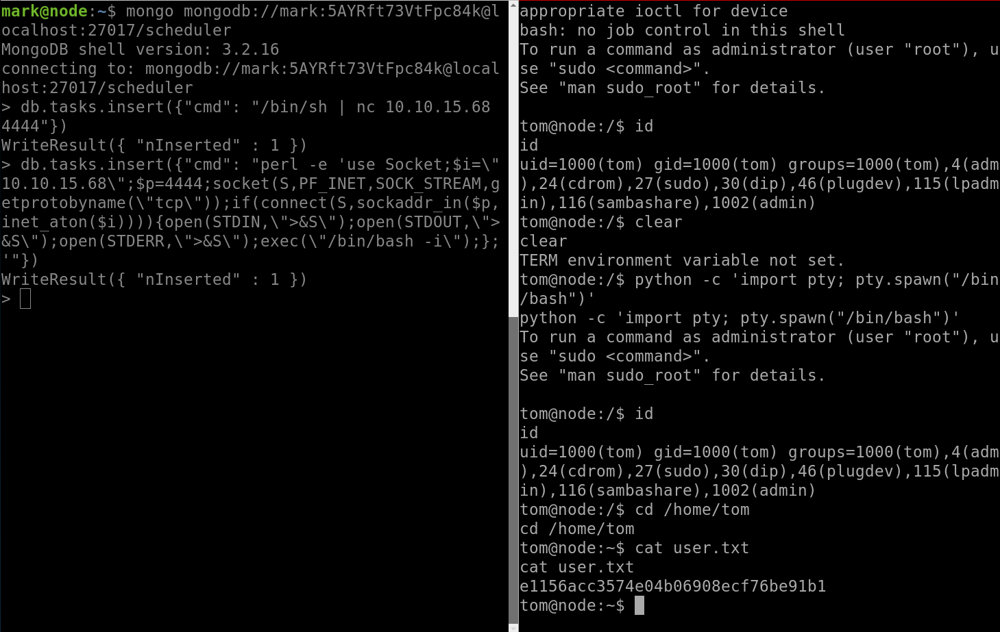

And finally! We have user `User: e1156acc3574e04b06908ecf76be91b1`

System
----------

I was stuck for a long time on enumeration, but in the end when I was examining the app.js file that we got earlier, 
I saw some interesting lines
```
app.get('/api/admin/backup', function (req, res) {
    if (req.session.user && req.session.user.is_admin) {
      var proc = spawn('/usr/local/bin/backup', ['-q', backup_key, __dirname ]);
      var backup = '';

      proc.on("exit", function(exitCode) {
        res.header("Content-Type", "text/plain");
        res.header("Content-Disposition", "attachment; filename=myplace.backup");
        res.send(backup);
      });

      proc.stdout.on("data", function(chunk) {
        backup += chunk;
      });

      proc.stdout.on("end", function() {
      });
    }
    else {
      res.send({
        authenticated: false
      });
    }
  });
```
Notice the `/usr/local/bin/backup` executable, we are able to run it with root privileges, which means we could get the 
root.txt by supplying this executable with the backup_key parameter.
```
tom@node:~$ ls -la /usr/local/bin
ls -la /usr/local/bin
total 28
drwxr-xr-x  2 root root   4096 Sep  3 11:31 .
drwxr-xr-x 10 root root   4096 Aug 29  2017 ..
-rwsr-xr--  1 root admin 16484 Sep  3 11:30 backup

```
So `./backup -q 45fac180e9eee72f4fd2d9386ea7033e52b7c740afc3d98a8d0230167104d474 /root/root.txt`

Output was base64 encoded so after decoding and using `7z e <zip file>` to extract, I got...

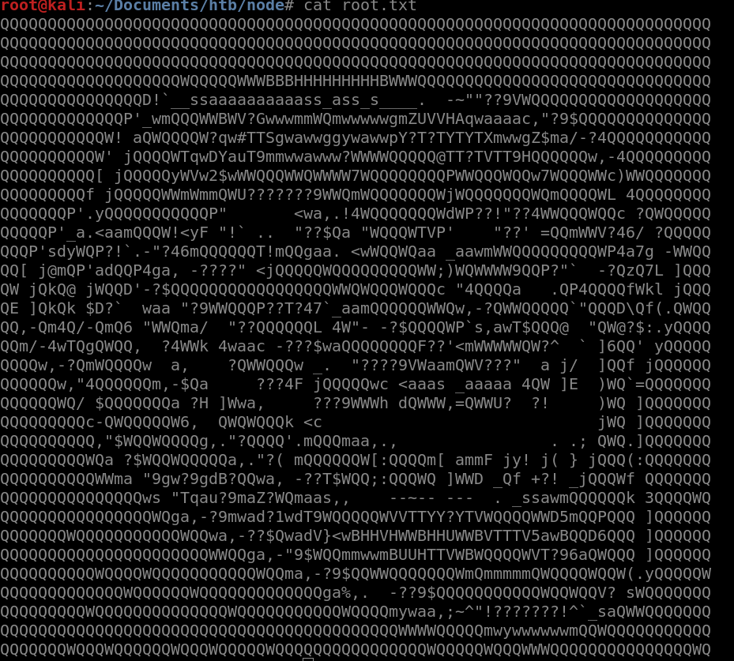

Trolled....

After fiddling with the program, I guess if the input contains 'root', we will be trolled. But anything else is okay and 
we just be given the actual file.

Googling how to do this, I found a great website https://medium.com/secjuice/waf-evasion-techniques-718026d693d8

`./backup -q 45fac180e9eee72f4fd2d9386ea7033e52b7c740afc3d98a8d0230167104d474 /r??t/`

And then we finally got the root.txt

`Root: 1722e99ca5f353b362556a62bd5e6be0`


 
